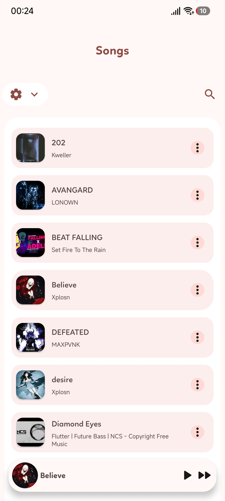
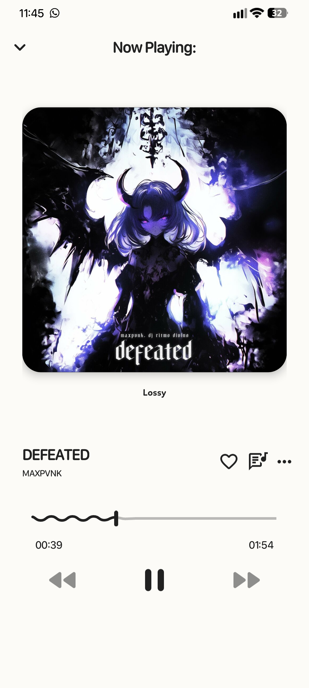
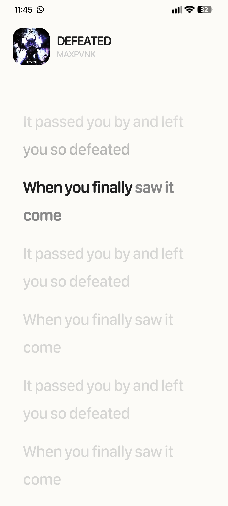

  

# 🎵 Astra Music Player  

Un **reproductor de música minimalista y ligero** para Android con soporte completo a **Material You (M3)**.  
Diseñado para ofrecer simplicidad, rendimiento y estilo moderno.  

---

---

## ✨ Características principales

- 🎶 **Reproducción local** de música con interfaz fluida  
- 📂 **Listas de reproducción** y **favoritos**  
- 🎚️ **Ecualizador integrado** y controles avanzados  
- 🎨 **Colores dinámicos (Material You / M3)**  
- 📜 **Letras sincronizadas en tiempo real (.lrc)**  
- 📀 Navegación por **álbumes, artistas y canciones**  
- 🔔 Notificación y mini-player con controles multimedia  
- ⚡ Interfaz **rápida, moderna y expresiva**, ideal para todo tipo de dispositivos  

---

## 📲 Capturas de pantalla

| Inicio | Reproductor | Letras sincronizadas |
|--------|-------------|----------------------|
|  |  |  |

---

## 🚀 Estado del proyecto

Astra Music está en **desarrollo semi activo** y evoluciona de forma lenta pero completa.  
Es un proyecto **personal y cerrado**, creado íntegramente con **Sketchware Pro** y **Android IDE**.  

> 🔒 **Nota:** No es open-source. Este proyecto es de un solo desarrollador y no acepta contribuciones externas.

---

## 🛣️ Roadmap

🔜 **Próximas actualizaciones previstas:**

- 🖼️ Carátulas animadas en el reproductor  
- 🎨 Más opciones de **personalización**
- 📄 Optimizacion y mejora de UI en el **Lyrics View**
- ⚡ Mejoras de rendimiento en la carga de listas grandes  

---

## 🛠️ Tecnologías usadas

- ⚙️ **Java** (Sketchware Pro + Android IDE)  
- 📦 **AndroidX**  
- 🎧 **MediaPlayer** para audio  
- 🖼️ **Picasso** para carga de carátulas  
- 🎨 **Palette + Material 3** para dinámicas de color  

---

## 📦 Descargar la última versión

Accede siempre a la última versión estable desde la sección de [Releases](https://github.com/d4v1xd/Astra-Music/releases).

---

## 📄 Licencia

Este proyecto es **cerrado y de uso personal**.  
**Todos los derechos reservados © 2025** – No se permite redistribución, modificación ni uso comercial sin autorización expresa.

---
## 👥 Agradecimientos:

• Quiero agradecer de forma directa a @PixelPlay y sus respectivos creadores, gracias a ese proyecto pude inspirarme en esta versión y le doy créditos totalmente a ellos. 

---

## 👤 Autor

Desarrollado con ❤️ por **D 4 v 1 d / @d4v1xd**
